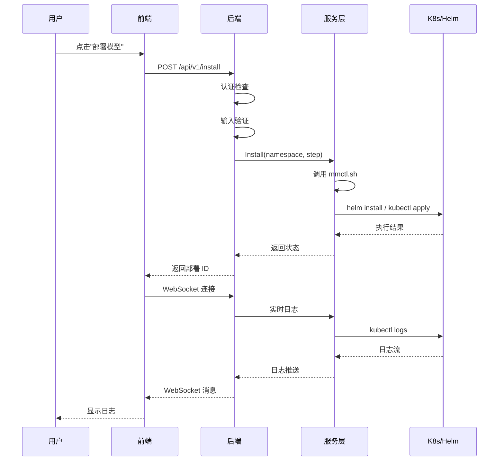
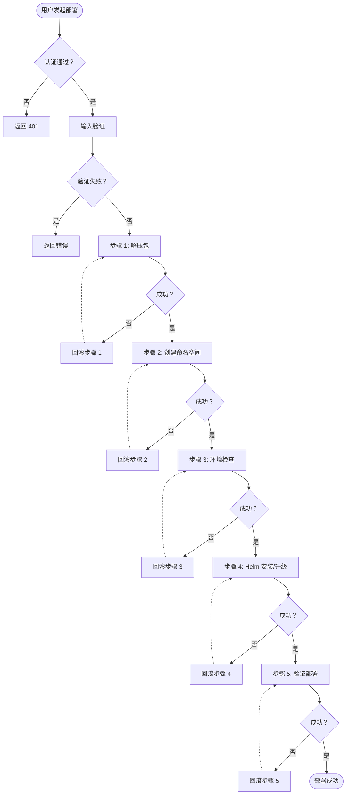
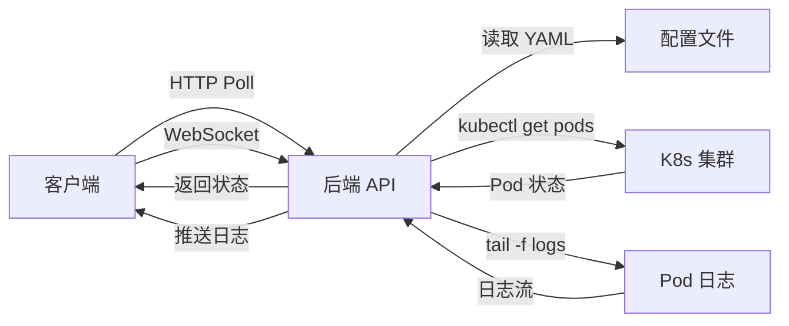
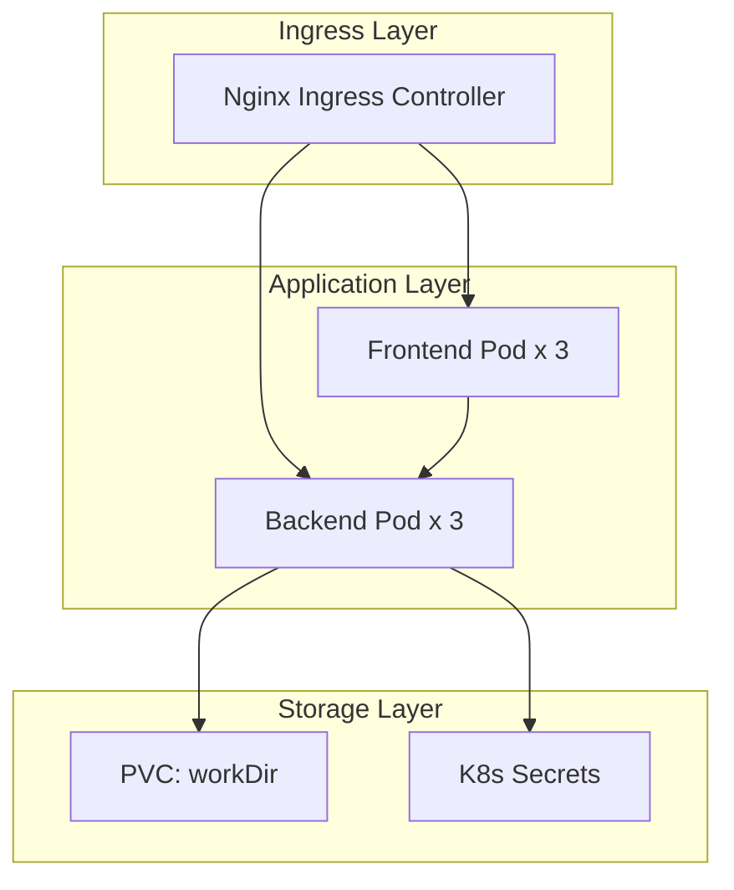

# 模法师部署控制台 - 设计文档

> 文档版本：v1.0  
> 最后更新：2026-04-01  
> 作者：超级龙虾队

---

## 1. 系统架构

### 1.1 整体架构图

```mermaid
graph TB
    subgraph "客户端层"
        A[Web 浏览器]
        B[CLI 工具]
    end

    subgraph "前端层 (Vue 3)"
        C[UI 组件 (Element Plus)]
        D[路由管理 (Vue Router)]
        E[状态管理 (Pinia)]
        F[API 客户端 (Axios)]
    end

    subgraph "后端层 (Go)"
        G[HTTP 服务器 (Gin)]
        H[认证中间件]
        I[日志中间件]
        J[速率限制中间件]
        K[API 路由]
    end

    subgraph "服务层"
        L[mmctl 服务<br/>Shell 脚本调用]
        M[Helm 集成<br/>待实现]
        N[K8s API 客户端<br/>待实现]
    end

    subgraph "数据层"
        O[YAML 配置存储<br/>workDir/]
        P[K8s 集群<br/>Namespace/ConfigMap/Secret]
        Q[日志存储<br/>K8s Pod Logs]
    end

    A --> C
    B --> K
    C --> D
    C --> E
    C --> F
    F --> G
    G --> H
    G --> I
    G --> J
    G --> K
    K --> L
    K --> M
    K --> N
    L --> O
    L --> P
    M --> P
    N --> P
    N --> Q
```

### 1.2 组件交互流程



---

## 2. 核心模块设计

### 2.1 API 层

#### 2.1.1 路由结构

```
/
├── /health (GET) - 健康检查 (公开)
└── /api/v1
    ├── /namespaces
    │   ├── GET (公开/认证) - 列表
    │   ├── GET /:name (公开/认证) - 详情
    │   ├── POST (认证) - 创建
    │   ├── PUT /:name (认证) - 更新
    │   └── DELETE /:name (认证) - 删除
    ├── /install (POST) - 开始安装 (认证)
    ├── /uninstall (POST) - 开始卸载 (认证)
    ├── /upgrade (POST) - 开始升级 (认证) [待实现]
    ├── /rollback (POST) - 开始回滚 (认证) [待实现]
    ├── /scale (PUT) - 扩缩容 (认证) [待实现]
    ├── /access/:name (GET) - 获取访问地址 (公开)
    └── /logs/ws (GET) - WebSocket 日志 (公开)
```

#### 2.1.2 中间件链

```go
// 路由组配置
api := r.Group("/api/v1")
api.Use(middleware.Logging())           // 日志记录
api.Use(middleware.RateLimit(60))       // 速率限制

// 敏感操作需要认证
sensitive := api.Group("")
sensitive.Use(middleware.AuthMiddleware(apiKey))
{
    sensitive.POST("/install", ...)
    sensitive.POST("/uninstall", ...)
    sensitive.PUT("/scale", ...)
}

// 只读操作可公开访问
readonly := api.Group("")
readonly.Use(middleware.ReadOnlyAuth())  // GET/HEAD 免认证
{
    readonly.GET("/namespaces", ...)
    readonly.GET("/namespaces/:name", ...)
    readonly.GET("/access/:name", ...)
}
```

### 2.2 服务层

#### 2.2.1 mmctl 服务 (`backend/internal/service/mmctl.go`)

```go
type MmctlService struct {
    scriptPath string
    workDir    string
    logger     *zap.Logger
}

// 核心方法
func (s *MmctlService) Install(namespace string, step int, logCallback func(string)) error
func (s *MmctlService) Uninstall(namespace string, step int, logCallback func(string)) error
func (s *MmctlService) Upgrade(namespace string, version string, logCallback func(string)) error [待实现]
func (s *MmctlService) Rollback(namespace string, version string, logCallback func(string)) error [待实现]
func (s *MmctlService) Scale(namespace string, replicas int) error [待实现]
```

#### 2.2.2 Shell 脚本调用逻辑

```bash
# mmctl.sh 调用模式
case $1 in
    "01") extract_packages ;;
    "02") new_namespace "$2" ;;
    "03") check_environment ;;
    "04") install "$2" "$3" ;;  # $3 = step
    "05") get_access "$2" ;;
    "88") uninstall "$2" "$3" ;; # $3 = step
    "89") upgrade "$2" "$3" ;;   # [待实现]
    "90") rollback "$2" "$3" ;;  # [待实现]
esac
```

### 2.3 数据层

#### 2.3.1 配置存储结构

```
workDir/
├── {namespace}/
│   ├── main.yml           # 主配置 (Helm values)
│   ├── hosts              #  hosts 文件
│   ├── secrets/           # [待实现] 加密存储
│   └── history/           # [待实现] 版本历史
│       ├── v1.0.0/
│       └── v1.0.1/
└── config.yaml            # 全局配置
```

#### 2.3.2 Secret 管理设计

```go
// 加密策略
type SecretManager struct {
    encryptionKey []byte
}

func (m *SecretManager) Encrypt(data string) (string, error)
func (m *SecretManager) Decrypt(encrypted string) (string, error)
func (m *SecretManager) CreateSecret(namespace, name, data map[string]string) error
func (m *SecretManager) GetSecret(namespace, name string) (map[string]string, error)
func (m *SecretManager) UpdateSecret(namespace, name string, data map[string]string) error
```

---

## 3. 关键流程设计

### 3.1 部署流程 (安装/升级/回滚)



### 3.2 状态查询流程



---

## 4. 接口规范

### 4.1 RESTful API 详细定义

#### 4.1.1 命名空间管理

```http
# 创建命名空间
POST /api/v1/namespaces
Content-Type: application/json
Authorization: Bearer {api_key}

{
  "name": "production",
  "description": "生产环境",
  "config": {
    "image_tag": "v1.0.0",
    "replicas": 3,
    "resources": {
      "cpu": "500m",
      "memory": "512Mi"
    }
  }
}

# 响应
{
  "code": 0,
  "data": {
    "name": "production",
    "status": "created",
    "created_at": "2026-04-01T12:00:00Z"
  }
}
```

#### 4.1.2 模型部署

```http
# 开始安装
POST /api/v1/install
Content-Type: application/json
Authorization: Bearer {api_key}

{
  "namespace": "production",
  "step": 0  # 0 = 全部步骤
}

# 开始回滚 [待实现]
POST /api/v1/rollback
Content-Type: application/json
Authorization: Bearer {api_key}

{
  "namespace": "production",
  "target_version": "v1.0.0"
}
```

### 4.2 WebSocket 事件定义

```json
// 日志事件
{
  "type": "log",
  "data": {
    "namespace": "production",
    "timestamp": "2026-04-01T12:00:00Z",
    "level": "INFO",
    "message": "Pod production/magic-admin-xxx started"
  }
}

// 状态更新事件
{
  "type": "status",
  "data": {
    "namespace": "production",
    "step": 3,
    "total_steps": 5,
    "status": "running",
    "message": "环境检查通过"
  }
}

// 错误事件
{
  "type": "error",
  "data": {
    "namespace": "production",
    "step": 4,
    "code": "INSTALL_FAILED",
    "message": "Helm 安装失败：timeout"
  }
}
```

---

## 5. 安全设计

### 5.1 认证机制

```go
// 认证中间件实现
func AuthMiddleware(apiKey string) gin.HandlerFunc {
    return func(c *gin.Context) {
        authHeader := c.GetHeader("Authorization")
        if authHeader == "" {
            c.JSON(401, gin.H{"error": "missing authorization header"})
            c.Abort()
            return
        }
        
        parts := strings.SplitN(authHeader, " ", 2)
        if len(parts) != 2 || parts[0] != "Bearer" {
            c.JSON(401, gin.H{"error": "invalid authorization format"})
            c.Abort()
            return
        }
        
        if parts[1] != apiKey {
            c.JSON(401, gin.H{"error": "invalid api key"})
            c.Abort()
            return
        }
        
        c.Next()
    }
}
```

### 5.2 输入验证

```go
// 命名空间验证
var namespaceRegex = regexp.MustCompile(`^[a-z0-9-]+$`)

func ValidateNamespace(name string) error {
    if !namespaceRegex.MatchString(name) {
        return fmt.Errorf("invalid namespace format: must be lowercase alphanumeric and hyphens")
    }
    if len(name) < 3 || len(name) > 63 {
        return fmt.Errorf("namespace length must be between 3 and 63")
    }
    return nil
}
```

### 5.3 Secret 加密存储

- **加密算法**: AES-256-GCM
- **密钥管理**: 环境变量 `SECRET_ENCRYPTION_KEY`
- **存储格式**: Base64 编码的加密密文
- **密钥轮换**: 支持多版本密钥，自动解密旧数据

---

## 6. 部署架构

### 6.1 本地开发环境

```yaml
# docker-compose.yml
services:
  backend:
    build:
      context: .
      dockerfile: Dockerfile.backend
    ports:
      - "8080:8080"
    environment:
      - API_KEY=${API_KEY}
      - WORK_DIR=/data/workDir
    volumes:
      - ./workDir:/data/workDir

  frontend:
    build:
      context: .
      dockerfile: Dockerfile.frontend
    ports:
      - "3000:80"
    depends_on:
      - backend
```

### 6.2 生产环境 (K8s + Helm)



---

## 7. 附录

### 7.1 错误码定义

| 错误码 | 描述 | HTTP 状态码 |
|--------|------|------------|
| 0 | 成功 | 200 |
| 1001 | 认证失败 | 401 |
| 1002 | 权限不足 | 403 |
| 2001 | 命名空间不存在 | 404 |
| 2002 | 命名空间已存在 | 409 |
| 3001 | 部署失败 | 500 |
| 3002 | Helm 执行失败 | 500 |
| 4001 | 输入参数无效 | 400 |

### 7.2 技术栈清单

| 层级 | 技术 | 版本 |
|------|------|------|
| 前端 | Vue 3 | 3.4+ |
| 前端 | Element Plus | 2.5+ |
| 前端 | TypeScript | 5.0+ |
| 后端 | Go | 1.22+ |
| 后端 | Gin | 1.9+ |
| 后端 | Zap | 1.26+ |
| 基础设施 | Helm | 3.12+ |
| 基础设施 | K8s | 1.27+ |
| 容器 | Docker | 24+ |

---

*本文档由超级龙虾队自动生成，内容可能随项目迭代而更新。*