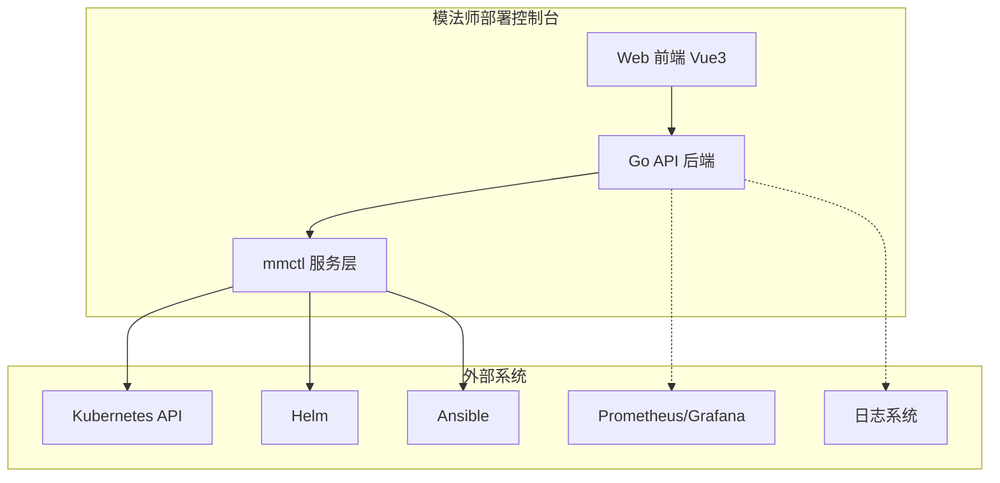

# 模法师部署控制台 - 需求文档

> 文档版本：v1.0  
> 最后更新：2026-04-01  
> 作者：超级龙虾队

---

## 1. 项目背景

### 1.1 项目定位

**模法师部署控制台 (ModelMagic Deploy Console)** 是一个面向 Kubernetes 环境的模型部署管理平台，旨在简化模法师 (ModelMagic) 系列模型在 K8s 集群中的部署、管理和运维工作。

### 1.2 项目目标

- **简化部署流程**：通过 Web 界面和 API，将复杂的 Helm + Ansible 部署流程封装为友好的操作
- **统一管理界面**：提供集中式的命名空间、模型实例、配置管理界面
- **实时监控**：实时展示部署状态、日志、事件和系统健康度
- **自动化运维**：支持自动扩缩容、健康检查、告警通知
- **安全可控**：实现细粒度的权限控制、Secret 加密、审计日志

### 1.3 系统边界

---

## 2. 用户角色

### 2.1 角色定义

| 角色 | 描述 | 主要职责 |
|------|------|----------|
| **管理员** | 系统最高权限用户 | 用户管理、系统配置、全局监控、安全策略 |
| **开发者** | 模型部署与调试人员 | 创建命名空间、部署模型、查看日志、调试配置 |
| **运维人员** | 系统维护人员 | 监控状态、处理告警、扩缩容、备份恢复 |

### 2.2 权限矩阵

| 功能 | 管理员 | 开发者 | 运维人员 |
|------|--------|--------|----------|
| 命名空间 CRUD | ✅ | ✅ (仅自己) | ✅ |
| 模型安装/升级 | ✅ | ✅ | ✅ |
| 模型回滚/卸载 | ✅ | ⚠️ (需确认) | ✅ |
| 查看日志/事件 | ✅ | ✅ | ✅ |
| 扩缩容操作 | ✅ | ⚠️ (仅自己) | ✅ |
| 配置管理 | ✅ | ✅ (只读) | ✅ |
| 用户管理 | ✅ | ❌ | ❌ |
| 系统配置 | ✅ | ❌ | ❌ |
| 告警配置 | ✅ | ❌ | ✅ |

---

## 3. 功能需求

### 3.1 命名空间管理 (Namespace Management)

#### 3.1.1 功能描述
为每个模型实例创建独立的 Kubernetes 命名空间，实现资源隔离和配置独立管理。

#### 3.1.2 功能列表
- **创建命名空间**：自动生成 hosts 文件和 main.yml 配置文件
- **查询命名空间**：列出所有命名空间，获取单个命名空间详情
- **更新命名空间**：修改配置参数（如镜像版本、资源限制）
- **删除命名空间**：清理命名空间配置（需确认是否已部署）

#### 3.1.3 验收标准
- 命名空间名称必须符合正则 `^[a-z0-9-]+$`
- 创建时自动生成标准配置文件模板
- 删除前需检查部署状态并提示风险

### 3.2 模型部署 (Model Deployment)

#### 3.2.1 安装 (Install)
- 支持分步安装（step 参数控制）
- 实时日志推送（WebSocket）
- 安装进度跟踪
- 失败自动回滚（待实现）

#### 3.2.2 升级 (Upgrade) - **待实现**
- 支持版本升级
- 保留现有配置
- 平滑滚动更新
- 升级失败自动回滚

#### 3.2.3 回滚 (Rollback) - **待实现**
- 支持回滚到指定版本
- 保留历史版本记录
- 快速回滚操作
- 回滚状态跟踪

#### 3.2.4 卸载 (Uninstall)
- 分步卸载流程
- 资源清理验证
- 配置保留选项

### 3.3 状态监控 (Status Monitoring)

#### 3.3.1 部署状态
- 实时显示 Pod 状态（Running/Pending/Failed）
- 服务就绪状态
- 资源使用率（CPU/Memory）

#### 3.3.2 日志查询
- **实时日志**：WebSocket 推送
- **历史日志**：按时间范围查询
- **日志过滤**：按级别、关键词筛选
- **日志导出**：支持下载

#### 3.3.3 事件查询
- K8s Events 展示
- 部署事件时间线
- 告警事件标记

### 3.4 扩缩容 (Scaling)

#### 3.4.1 手动扩缩容
- 调整副本数（Replicas）
- 调整资源配额（CPU/Memory）
- 立即生效

#### 3.4.2 自动扩缩容 (HPA) - **待实现**
- 基于 CPU 使用率自动扩缩
- 基于内存使用率自动扩缩
- 自定义扩缩容策略
- 扩缩容历史记录

### 3.5 配置管理 (Configuration Management)

#### 3.5.1 ConfigMap 管理
- 查看 ConfigMap 内容
- 编辑 ConfigMap
- 热更新配置（待实现）

#### 3.5.2 Secret 管理 - **待实现**
- 加密存储敏感信息
- Base64 编码/解码
- 密钥轮换
- 访问审计

### 3.6 健康检查与告警 (Health Check & Alerting)

#### 3.6.1 健康检查
- Liveness Probe
- Readiness Probe
- Startup Probe
- 健康状态仪表盘

#### 3.6.2 告警配置 - **待实现**
- 告警规则定义
- 告警通知渠道（邮件/钉钉/飞书）
- 告警级别（Info/Warning/Critical）
- 告警历史

---

## 4. 非功能需求

### 4.1 安全性 (Security)

| 需求 | 描述 | 优先级 |
|------|------|--------|
| 认证机制 | API Key / Bearer Token 认证 | 高 |
| 输入验证 | 所有输入参数正则验证 | 高 |
| Secret 加密 | 敏感信息加密存储 | 高 |
| 审计日志 | 所有操作记录日志 | 中 |
| HTTPS | 生产环境强制 HTTPS | 高 |
| RBAC | 基于角色的访问控制 | 中 |

### 4.2 性能 (Performance)

| 需求 | 指标 | 优先级 |
|------|------|--------|
| API 响应时间 | < 200ms (P95) | 高 |
| 并发支持 | ≥ 100 并发请求 | 中 |
| WebSocket 延迟 | < 100ms | 中 |
| 日志推送速率 | ≥ 1000 条/秒 | 低 |

### 4.3 可用性 (Availability)

| 需求 | 指标 | 优先级 |
|------|------|--------|
| 系统可用性 | ≥ 99.5% | 高 |
| 故障恢复时间 | < 5 分钟 | 高 |
| 数据备份 | 每日自动备份 | 中 |
| 优雅关闭 | 支持信号处理 | 高 |

### 4.4 可扩展性 (Scalability)

| 需求 | 描述 | 优先级 |
|------|------|--------|
| 水平扩展 | 支持多实例部署 | 中 |
| 插件机制 | 支持扩展部署步骤 | 低 |
| 多集群支持 | 支持管理多个 K8s 集群 | 低 |

---

## 5. 功能实现矩阵

基于代码审查结果，当前功能实现状态如下：

### 5.1 后端功能

| 功能模块 | 功能点 | 状态 | 说明 |
|----------|--------|------|------|
| **命名空间管理** | 创建 | ✅ 已实现 | `POST /api/v1/namespaces` |
| | 查询列表 | ✅ 已实现 | `GET /api/v1/namespaces` |
| | 查询详情 | ✅ 已实现 | `GET /api/v1/namespaces/:name` |
| | 更新 | ✅ 已实现 | `PUT /api/v1/namespaces/:name` |
| | 删除 | ⚠️ 部分实现 | 仅返回成功，未检查部署状态 |
| **模型部署** | 安装 | ✅ 已实现 | `POST /api/v1/install` |
| | 升级 | ❌ 未实现 | 需要补充 |
| | 回滚 | ❌ 未实现 | 需要补充 |
| | 卸载 | ✅ 已实现 | `POST /api/v1/uninstall` |
| **状态监控** | 状态查询 | ⚠️ 部分实现 | 依赖 mmctl 脚本 |
| | 实时日志 | ⚠️ 部分实现 | WebSocket 框架已搭建 |
| | 事件查询 | ❌ 未实现 | 需要补充 |
| **扩缩容** | 手动扩容 | ❌ 未实现 | 需要补充 |
| | 手动缩容 | ❌ 未实现 | 需要补充 |
| | 自动扩缩容 | ❌ 未实现 | 需要集成 HPA |
| **配置管理** | ConfigMap 查看 | ❌ 未实现 | 需要补充 |
| | ConfigMap 编辑 | ❌ 未实现 | 需要补充 |
| | Secret 管理 | ❌ 未实现 | 需要补充 |
| **健康检查** | 健康检查接口 | ✅ 已实现 | `GET /health` |
| | 告警配置 | ❌ 未实现 | 需要补充 |

### 5.2 前端功能

| 功能模块 | 功能点 | 状态 | 说明 |
|----------|--------|------|------|
| **基础框架** | 项目搭建 | ✅ 已实现 | Vite + Vue 3 + TypeScript |
| | 路由配置 | ✅ 已实现 | Vue Router |
| | 状态管理 | ✅ 已实现 | Pinia |
| | UI 组件 | ✅ 已实现 | Element Plus |
| **命名空间管理** | 列表展示 | ❌ 未实现 | 需要开发 |
| | 创建表单 | ❌ 未实现 | 需要开发 |
| | 详情页面 | ❌ 未实现 | 需要开发 |
| | 编辑表单 | ❌ 未实现 | 需要开发 |
| **部署管理** | 安装向导 | ❌ 未实现 | 需要开发 |
| | 升级向导 | ❌ 未实现 | 需要开发 |
| | 回滚操作 | ❌ 未实现 | 需要开发 |
| | 卸载确认 | ❌ 未实现 | 需要开发 |
| **监控面板** | 状态仪表盘 | ❌ 未实现 | 需要开发 |
| | 日志查看器 | ❌ 未实现 | 需要开发 |
| | 事件时间线 | ❌ 未实现 | 需要开发 |
| **配置管理** | ConfigMap 编辑器 | ❌ 未实现 | 需要开发 |
| | Secret 管理器 | ❌ 未实现 | 需要开发 |

### 5.3 基础设施

| 组件 | 状态 | 说明 |
|------|------|------|
| Docker Compose | ✅ 已实现 | 本地开发环境 |
| Nginx | ✅ 已实现 | 前端反向代理 |
| 配置文件 | ✅ 已实现 | YAML 配置加载 |
| 日志系统 | ✅ 已实现 | Zap 日志库 |
| 认证中间件 | ⚠️ 部分实现 | 基础框架，需完善 |
| 速率限制 | ✅ 已实现 | 中间件已搭建 |

---

## 6. 接口规范摘要

### 6.1 RESTful API 列表

| 方法 | 路径 | 描述 | 认证 |
|------|------|------|------|
| GET | `/health` | 健康检查 | ❌ |
| GET | `/api/v1/namespaces` | 列出命名空间 | ❌ |
| GET | `/api/v1/namespaces/:name` | 获取命名空间详情 | ❌ |
| POST | `/api/v1/namespaces` | 创建命名空间 | ✅ |
| PUT | `/api/v1/namespaces/:name` | 更新命名空间 | ✅ |
| DELETE | `/api/v1/namespaces/:name` | 删除命名空间 | ✅ |
| POST | `/api/v1/install` | 开始安装 | ✅ |
| POST | `/api/v1/uninstall` | 开始卸载 | ✅ |
| GET | `/api/v1/access/:name` | 获取访问地址 | ❌ |
| GET | `/api/v1/logs/ws` | WebSocket 日志 | ❌ |

### 6.2 WebSocket 事件

| 事件类型 | 方向 | 描述 |
|----------|------|------|
| `log` | 服务端 → 客户端 | 实时日志推送 |
| `status` | 服务端 → 客户端 | 状态更新 |
| `error` | 服务端 → 客户端 | 错误通知 |

---

## 7. 附录

### 7.1 术语表

| 术语 | 英文 | 描述 |
|------|------|------|
| 命名空间 | Namespace | Kubernetes 资源隔离单元 |
| Helm | Helm | K8s 包管理工具 |
| ConfigMap | ConfigMap | K8s 配置存储 |
| Secret | Secret | K8s 敏感信息存储 |
| HPA | Horizontal Pod Autoscaler | 水平 Pod 自动扩缩容 |

### 7.2 参考文档

- [Kubernetes 官方文档](https://kubernetes.io/docs/)
- [Helm 官方文档](https://helm.sh/docs/)
- [Gin 框架文档](https://gin-gonic.com/docs/)
- [Vue 3 官方文档](https://vuejs.org/)

---

*本文档由超级龙虾队自动生成，内容可能随项目迭代而更新。*
